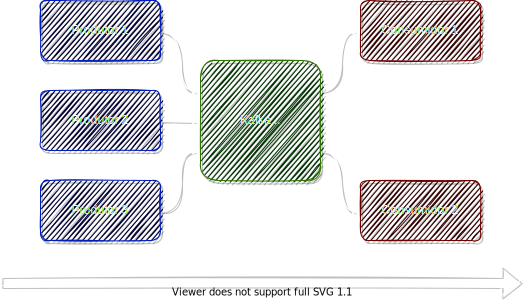

# Apache Kafka

_Introdução ao ecossistema_
\
\
Ermogenes Palacio

---

# Apache Kafka é...

 ...uma plataforma de _streaming_ de eventos distribuídos de código aberto usada por milhares de empresas para:
 - _pipelines_ de dados de alto desempenho
 - análise de _streaming_
 - integração de dados
 - aplicativos de missão crítica

<!-- footer: '[Site oficial](https://kafka.apache.org/) :: [_Cases_](https://kafka.apache.org/powered-by)' -->

---

# Entidades vs. eventos

- **Entidade**: algo que existe e é identificável
  - _existência_
- **Evento**: algo que aconteceu
  - _ocorrência_

Bancos de dados relacionais são organizados em torno do conceito de entidades, mas não escalam bem no tratamento de eventos.

Uma estrutura de dados que permite escalabilidade no tratamento de eventos é o _log_ (um registro persistente de eventos).

<!-- footer: '' -->

---

# _Streaming_ de eventos

Permite um fluxo contínuo e interpretável dos dados para que as informações estejam no lugar certo, na hora certa.

- Captura de dados em tempo real de **diferentes origens**
- **Armazenamento durável** dos fluxos de eventos
- **Processar** os fluxos de eventos em tempo real e retrospectivamente
- Direcionar os fluxos de eventos para **diferentes destinos**

<!-- footer: '' -->

---

# Casos de uso comuns

- Processar pagamentos e transações financeiras em tempo real
- Rastrear e monitorar carros, caminhões, frotas e remessas em tempo real
- Capturar e analisar continuamente os dados de sensores de dispositivos IoT
- Coletar e reagir imediatamente às interações (varejo, viagens, redes sociais, etc.)
- Monitorar pacientes em cuidados hospitalares e prever mudanças nas condições para garantir o tratamento oportuno em emergências
- Conectar, armazenar e disponibilizar dados produzidos por diferentes setores de uma organização
- Servir como base para integração de sistemas e plataformas de dados

<!-- footer: '' -->

---

# Plataforma de _streaming_ de eventos

- Funcionalidades:
  - Publicar (gravar) eventos no fluxo de eventos
  - Persistir o fluxo de eventos com a durabilidade desejada
  - Processar em tempo real e retrospectivamente (eventos passados)
  - Inscrever-se para receber (ler) eventos do fluxo de eventos

Escalável, tolerante a falhas, distribuído, seguro, _free_/_open source_, implantável em diversas plataformas (_on premises_ ou em nuvem, _bare-metal_, _VMs_, _containers_, SaaS).

<!-- footer: '' -->

---

# Componentes embutidos

- _Apache ZooKeeper_: coordenação
- _Apache Kafka_: mensageria e persistência, nos _brokers_
    - _Admin API_: configuração e inspeção do serviço
    - _Producer API_: entrada de dados
    - _Consumer API_: saída de dados
    - _Kafka Streams API_: transformação de dados
    - _Kafka Connect API_: criação e utilização de componentes reusáveis para casos de uso comuns de produção e consumo

<!-- footer: '' -->

---

# Apache ZooKeeper

- Componente requerido
- Realiza a coordenação entre os _brokers_ 
- _Cluster_ dedicado com um número ímpar de servidores (1 para desenvolvimento, 3 ou 5 para produção)

<!-- footer: '[Site oficial](https://zookeeper.apache.org/)' -->

---

# _Brokers_ (instâncias do Apache Kafka)

- Principal componente
- Entrada, persistência e saída dos registros
- Acesso binário, via TCP
  - APIs: Java, .NET, Python, Go, C++, ...
- _Cluster_ de 1 até centenas de servidores

<!-- footer: '' -->

---

# Estrutura de dados

- Evento, mensagem ou registro
  - Chave
  - Valor

São tratados como arranjos de _bytes_ (ou seja, binários) e não são desempacotados ou interpretados pelo Kafka.

As APIs possuem suporte para tipos complexos usando JSON e Apache Avro.

<!-- footer: '[JSON](https://datatracker.ietf.org/doc/html/rfc8259) :: [Apache Avro](https://avro.apache.org/)' -->

---

# Tópicos

Armazenas coleções de eventos.

- multi-produtor e multi-consumidor
- fila persistente, com desempenho constante O(1) em todas as operações
- retenção configurável por tempo ou tamanho
- materializados em arquivos físicos, chamados de partições

<!-- footer: '' -->

---

# Partições, _offset_ e replicação

- Tópicos são em partições, distribuídas entre os _brokers_
  - dados (.log) e índices (.index)
  - podem ser replicados em mais de um _broker_
- Registros com a mesma chave são armazenados sempre na mesma partição, garantindo o sequenciamento
- Registros sem chave são balanceados _round-robin_
- Cada registro recebe um número sequencial na partição chamado _offset_

<!-- footer: '' -->

---

# Produtores e consumidores

- **Produtores** são aplicações cliente que publicam eventos em tópicos, enviando dados a um _broker_ do _cluster_ através da _Producer API_.
- **Consumidores** são aplicações que se inscrevem em tópicos e recebem os seus eventos dos _brokers_ do _cluster_, utilizando a _Consumer API_.
  - Podem ser agrupados em _clusters_ de consumidores, garantindo a unicidade na leitura

Produtores e consumidores não são acoplados.

<!-- footer: '' -->

---

# Obrigado!
\
Ermogenes Palacio
github.com/ermogenes
\

<!--
paginate: false
footer: ''
header: ''
-->

---

# Referências

https://kafka.apache.org/
https://kafka.apache.org/powered-by
https://kafka.apache.org/documentation/
https://zookeeper.apache.org/
https://zookeeper.apache.org/doc/current/zookeeperOver.html
https://github.com/ermogenes/estudos-kafka
