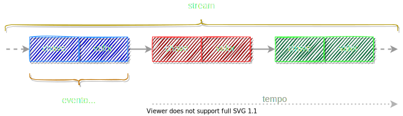
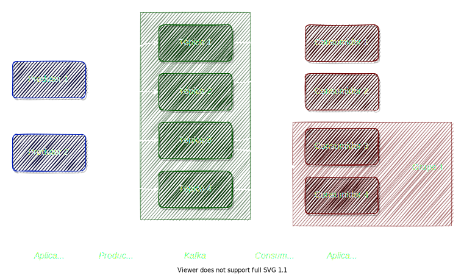

# Apache Kafka

_Introdução ao ecossistema_
\
\
\
Ermogenes Palacio

---

# Apache Kafka é...

 ...uma plataforma de _streaming_ de eventos distribuídos de código aberto usada por milhares de empresas
 
 * aplicativos de missão crítica;
 * análise de _streaming_;
 * _pipelines_ de dados de alto desempenho;
 * integração de dados.

<!-- footer: '[Site oficial](https://kafka.apache.org/) :: [_Cases_](https://kafka.apache.org/powered-by)' -->

---

# _Streaming_ de eventos

Permite um fluxo contínuo e interpretável dos dados para que as informações estejam no lugar certo, na hora certa

* captura de dados em tempo real de **diferentes origens**;
* **armazenamento durável** dos fluxos de eventos;
* **processamento** de fluxos de eventos em tempo real e em retrospectiva;
* direcionamento dos fluxos de eventos para **diferentes destinos**.

<!-- footer: '' -->

---

# _Streams_ e tabelas

<!-- footer: '' -->

---

# Entidades e eventos

<!--
- **Entidade**: algo que existe e é identificável
  * _existência_
* **Evento**: algo que aconteceu
  * _ocorrência_

Bancos de dados relacionais são organizados em torno do conceito de entidades, _mas não escalam bem no tratamento de eventos_.

Uma estrutura de dados que permite escalabilidade no tratamento de eventos é o _log_ (um registro persistente de eventos).
-->

<!-- footer: '' -->

---

# Casos de uso comuns

- _processar_ pagamentos e transações financeiras _em tempo real_;
* _rastrear e monitorar_ carros, caminhões, frotas e remessas em tempo real;
* capturar e _analisar continuamente_ os dados de sensores de dispositivos IoT;
* coletar e _reagir imediatamente_ às interações (varejo, viagens, redes sociais, etc.);
* monitorar pacientes em cuidados hospitalares e _prever mudanças nas condições_ para garantir o tratamento oportuno em emergências;
* conectar, armazenar e _disponibilizar dados_ produzidos por diferentes setores de uma organização;
* servir como base para _integração de sistemas_ e plataformas de dados;
* ...

<!-- footer: '' -->

---

# Plataforma de _streaming_ de eventos

Escalável, tolerante a falhas, distribuído, seguro, _free_/_open source_, implantável em diversas infraestruturas (_on premises_ ou em nuvem, _bare-metal_, _VMs_, _containers_, SaaS)

* Funcionalidades:
  - publicar (gravar) eventos no fluxo de eventos;
  * persistir o fluxo de eventos com a durabilidade desejada;
  * processar em tempo real e retrospectivamente (eventos passados);
  * inscrever-se para receber (ler) eventos do fluxo de eventos.

<!-- footer: '' -->

---

# Componentes do Kafka

- _Apache Kafka_: mensageria e persistência
    * _Admin API_: configuração e inspeção do serviço
    * _Producer API_: entrada de dados
    * _Consumer API_: saída de dados
    * _Streams API_: transformação de dados
    * _Connect API_: casos de uso comuns de produção e consumo
* _Apache ZooKeeper_: coordenação do _cluster_
* Ferramental comunitário e comercial

<!-- footer: '' -->

---

# Kafka _broker_

Principal componente:
- Entrada, persistência e saída dos registros
* Acesso binário, via TCP
  - Java, .NET, Python, Go, C++, ...
* _Cluster_ de 1 até centenas de servidores

<!-- footer: '' -->

---

# ZooKeeper quorum

Componente requerido:
- Realiza a coordenação entre os _brokers_
* _Cluster_ dedicado com um número ímpar de servidores (1 para desenvolvimento, 3 ou 5 para produção)

<!-- footer: '[Site oficial](https://zookeeper.apache.org/)' -->

---

# Estrutura de dados

_Log_ persistente de eventos, chamado **tópico**

* fila persistente, com desempenho constante `O(1)` em todas as operações
* evento, mensagem ou registro
* valor, chave ou ambos
* arranjos de _bytes_ (ou seja, binários)
  - JSON e Apache Avro

<!-- footer: '[JSON](https://datatracker.ietf.org/doc/html/rfc8259) :: [Apache Avro](https://avro.apache.org/)' -->

---

# Produtores e consumidores

<!--
- **Produtores** são aplicações cliente que publicam eventos em tópicos, enviando dados a um _broker_ do _cluster_ através da _Producer API_.
* **Consumidores** são aplicações que se inscrevem em tópicos e recebem os seus eventos dos _brokers_ do _cluster_, utilizando a _Consumer API_.
  * Podem ser agrupados em _clusters_ de consumidores, garantindo a unicidade na leitura

Produtores e consumidores não são acoplados.
-->

<!-- footer: '' -->

---

# Partição

- segmentos (`.log`) e índices (`.index`)
- seleção por chave, ou _round-robin_
- sequenciais na partição

<!-- footer: '' -->

---

# Replicação

Três _brokers_, tópico com 3 partições e fator de replicação 2

<!-- footer: '' -->

---

# Exclusão e compactação de _log_

Remove registros de acordo com a política de retenção (tempo ou tamanho)
\

<!-- footer: '' -->

---

# Kafka Streams

Fluxo de processamento, de tópicos para outros tópicos
\

<!-- footer: '[Docs](https://kafka.apache.org/28/documentation/streams/)' -->

---

# Kafka Connect

Consumo e despejo de dados sem programação, usando conectores
\

<!-- footer: '[Docs](https://kafka.apache.org/documentation.html#connectapi)' -->

---

# Confluent Schema Registry

Serialização e esquema de dados
\

<!-- footer: '[Docs](https://docs.confluent.io/platform/current/schema-registry/index.html)' -->

---

# Confluent REST Proxy

REST API para clientes
\

<!-- footer: '[Docs](https://docs.confluent.io/platform/current/kafka-rest/index.html)' -->

---

# Confluent ksqlDB

Integração de funcionalidades do Connect e do Streams, em linguagem semelhante ao SQL
* consulta;
* extração;
* transformação;
* persistência em fluxo.

<!-- footer: '[Docs](https://docs.confluent.io/platform/current/ksqldb/index.html)' -->

---

# Referências

- https://kafka.apache.org/
  <!-- - https://kafka.apache.org/powered-by -->
  <!-- - https://kafka.apache.org/documentation/ -->
- https://zookeeper.apache.org/
  <!-- - https://zookeeper.apache.org/doc/current/zookeeperOver.html -->
- https://docs.confluent.io/
<!-- - https://docs.confluent.io/platform/current/ -->
- https://www.confluent.io/confluent-community-license-faq/
- https://www.udemy.com/user/stephane-maarek/
- https://github.com/ermogenes/estudos-kafka

<!-- footer: '[pdf](Apache%20Kafka%20-%20Introdução%20ao%20ecossitema.pdf) :: [pptx](Apache%20Kafka%20-%20Introdução%20ao%20ecossitema.pptx)' -->

---

# Obrigado!
\
Ermogenes Palacio
github.com/ermogenes
\

<!--
paginate: false
header: ''
footer: ''
-->
